# 📋 Customer Management System

A simple **Spring Boot Customer Management System** that supports full
CRUD operations, search, and pagination with a clean Bootstrap UI.

This is for the short practical test purpose only.

------------------------------------------------------------------------

# 🚀 Features

✅ Add new customers\
✅ Edit existing customers\
✅ Delete customers\
✅ View customers with pagination\
✅ Search by name or email\
✅ Form validation (Name, Email, Phone)\
✅ Bootstrap UI with toast notifications\
✅ DTO pattern implementation\
✅ Clean layered architecture

------------------------------------------------------------------------

# 🛠 Tech Stack

-   **Java 21**
-   **Spring Boot**
-   **Spring Data JPA**
-   **Thymeleaf**
-   **MySQL**
-   **Bootstrap 5**
-   **Maven**

------------------------------------------------------------------------

# ⚙️ Prerequisites

-   Java 21+
-   Maven 3+
-   MySQL 8+
-   Git
-   IDE (VS Code)

------------------------------------------------------------------------

# 📦 Installation & Setup

## Start Apache & MySQL

If using XAMPP/WAMP:

- Start **Apache**
- Start **MySQL**

---

## Clone the project

```bash
git clone https://github.com/your-username/your-repo.git
```
------------------------------------------------------------------------

## 🗄 Database Setup

- Create Database

Login MySQL:
```
mysql -u root -p
```

Create database:
``` sql
CREATE DATABASE customer_db;
```
Command prompt or phpmyadmin can be used to create database.

- Create Mysql User
``` sql
CREATE USER 'customer_user'@'localhost' IDENTIFIED BY 'password';
GRANT ALL PRIVILEGES ON customer_db.* TO 'customer_user'@'localhost';
FLUSH PRIVILEGES;
```
if user want to use ikmal as username and 56789 as a password
``` sql
CREATE USER 'ikmal'@'localhost' IDENTIFIED BY '56789';
GRANT ALL PRIVILEGES ON customer_db.* TO 'customer_user'@'localhost';
FLUSH PRIVILEGES;
```

- Test User

Exit and login:
```
mysql -u ikmal -p
```

Then:
```
USE customer_db;
```
If works → OK ✅

------------------------------------------------------------------------

# 🔧 Configuration

Edit:

    src/main/resources/application.properties

### Database

``` properties
spring.datasource.url=jdbc:mysql://localhost:3306/customer_db?useSSL=false&serverTimezone=UTC
spring.datasource.username=customer_user
spring.datasource.password=password
```
Change username and password based on your username and password of mysql. If customer_user is ikmal and password is 56789, Then

``` properties
spring.datasource.url=jdbc:mysql://localhost:3306/customer_db?useSSL=false&serverTimezone=UTC
spring.datasource.username=ikmal
spring.datasource.password=56789
```


### JPA

``` properties
spring.jpa.hibernate.ddl-auto=update
spring.jpa.show-sql=true
spring.datasource.driver-class-name=com.mysql.cj.jdbc.Driver
```

### Thymeleaf

``` properties
spring.thymeleaf.cache=false
```

------------------------------------------------------------------------

# ▶️ How to Run

## Using IDE (VS Code)
Wait until all dependencies successfully installed.

## Using VS Code Terminal

## Build project
``` bash
mvn clean install
```
Wait Until build success.

## Check Database
Login MySQL:

```
USE customer_db;
```
```
SHOW TABLES;
```

or Check database using phpmyadmin.

Hibernate should auto-create tables.

## Run Application
``` bash
mvn spring-boot:run
```
Wait for:
```nginx
Started Application
Tomcat started on port 8080
```

## Access Application
Open browser:

http://localhost:8080/customers

------------------------------------------------------------------------

## 🔥 Common problems
❌ Port 3306 in use

Stop other MySQL services.

❌ Access denied

Wrong DB username/password.

❌ Tables not created

Check:

```
spring.jpa.hibernate.ddl-auto=update
```
------------------------------------------------------------------------

# 📖 Usage
## Start Page

No data at all

<p float="left">
  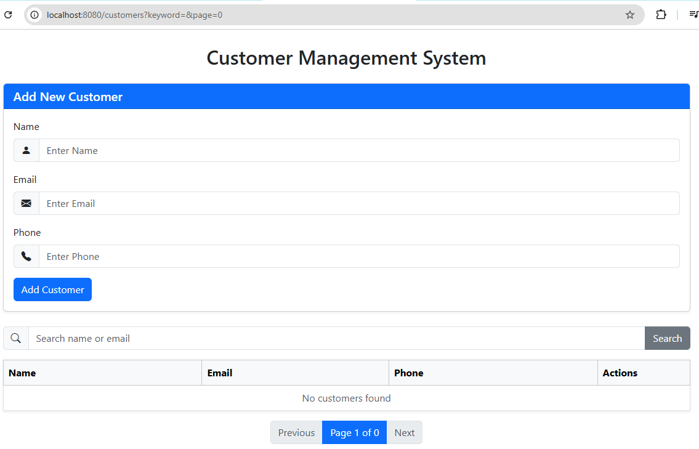
</p>

## Add Customer Record

Fill the form → Click Add Customer → Record Added Successfully

<p float="left">
  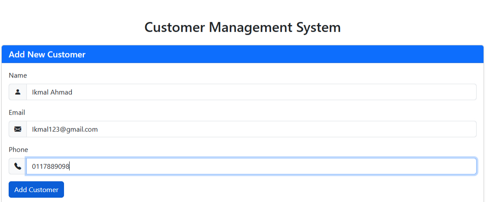
  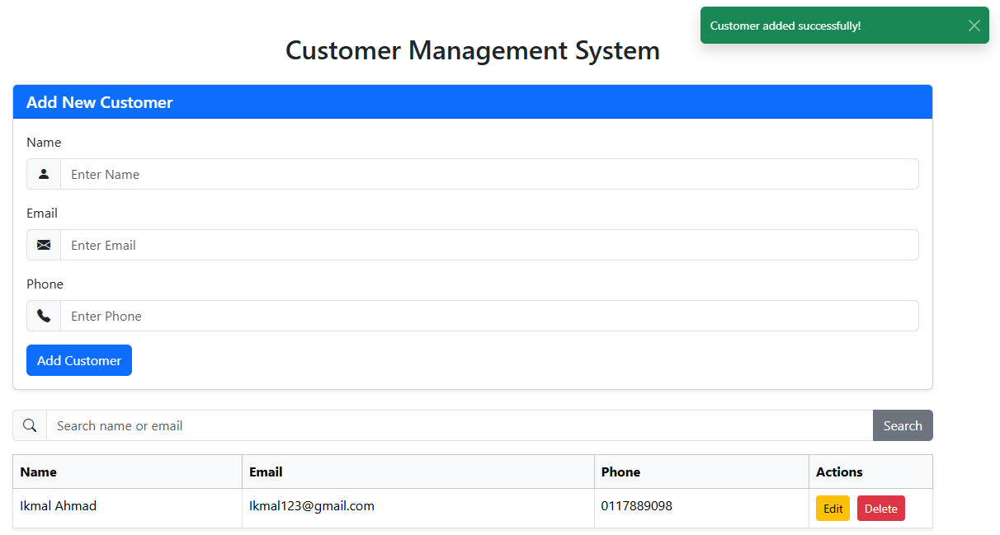
</p>

---

## Edit Customer Record

Click Edit button → Existing data appear in the form → Fill the form → Click Update Customer → Record Updated Successfully

Note : Click cancel to cancel the editing and it automatically redirect to the Add Customer interface.

<p float="left">
  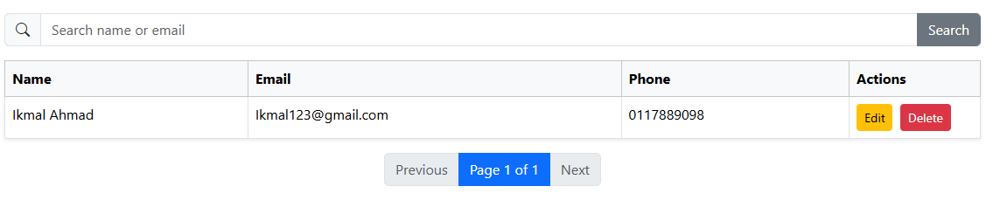
  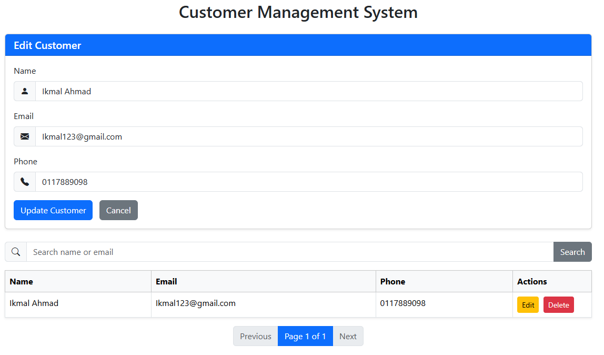
  
  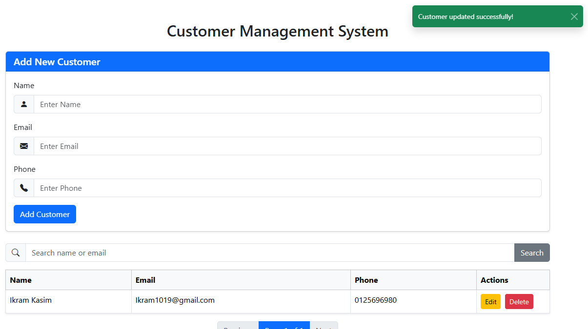
</p>

---

## Delete Customer

Click Delete button → Confirm → Record Deleted Successfully

<p float="left">
  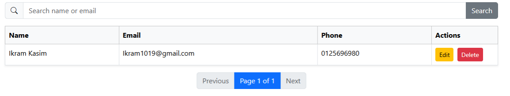
  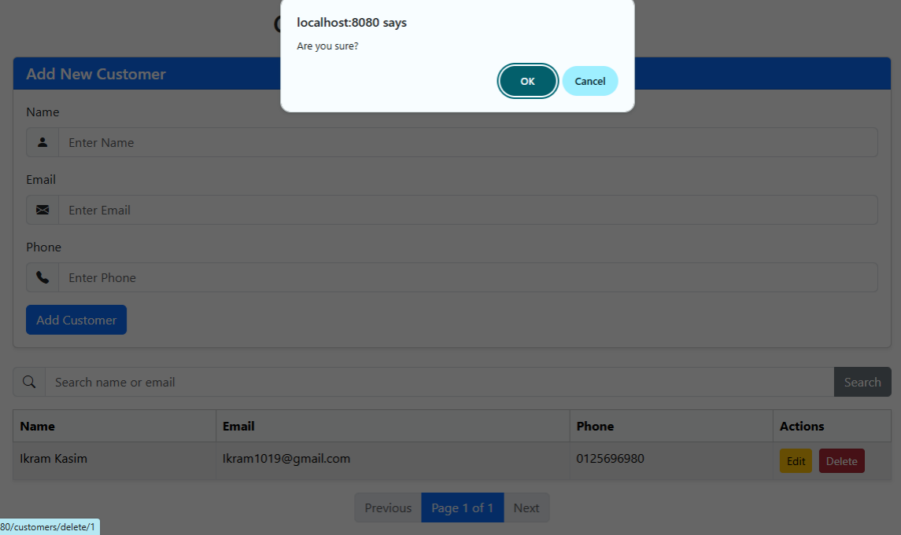
  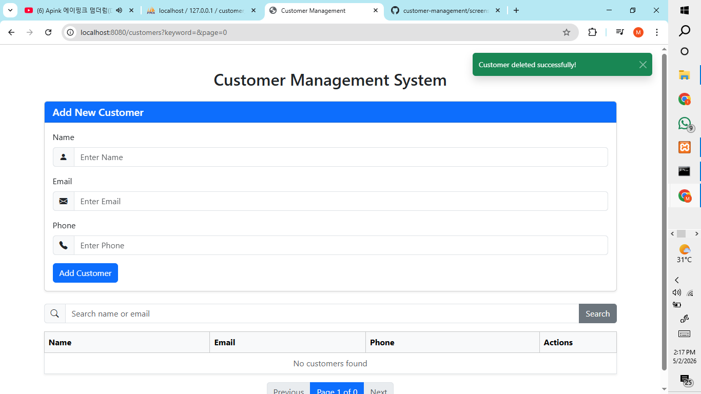
</p>

---

## Search Customer

Enter keyword (name or email) → Click Search button → Searched name or email appeared successfully

<p float="left">
  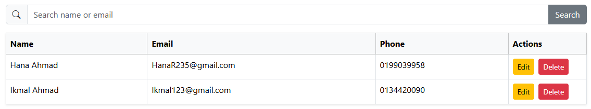
  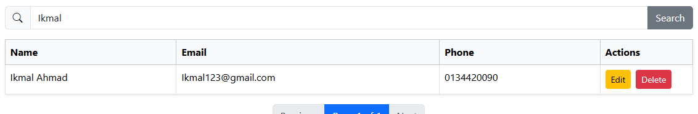
  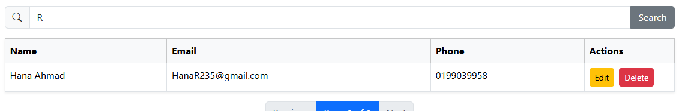  
</p>

---

## Pagination
Next interface only appear after more than 10 customer records stored successfully.
Use Previous/Next buttons to navigate interfaces.

